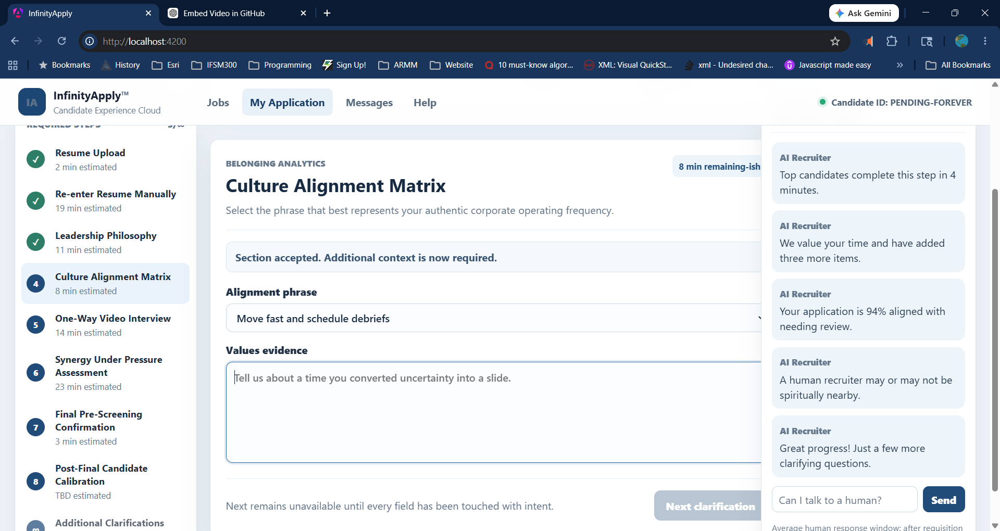

# Christopher Victores

<p align="center">
  
</p>

<p align="center">
  Full-Stack Developer • React • Next.js • Angular • Java • Spring Boot
</p>

<p align="center">
  Building marketplace systems, onboarding platforms, desktop applications, and interactive web experiences.
</p>

---

# About Me

Computer Science graduate and full-stack developer focused on building real-world systems and scalable web applications.

My work includes:
↳ Marketplace platforms and onboarding systems  
↳ Stripe payment integrations and transactional workflows  
↳ Supabase/PostgreSQL architectures  
↳ Angular and React frontends  
↳ Java desktop applications  
↳ Interactive UI/UX experiences and animations  

I enjoy combining technical architecture with creative frontend design to build applications that are both functional and visually engaging.

---

# Tech Stack

```txt
Frontend:
React • Next.js • Angular • TypeScript • Tailwind • RxJS

Backend:
Node.js • Java • Spring Boot • REST APIs • Firebase

Database & Infrastructure:
PostgreSQL • Supabase • Docker • Render • Cloudflare

Integrations:
Stripe • Sharetribe • Checkr • Google APIs

Other:
JavaFX • Playwright • Git • CI/CD
```

---

# Featured Projects

---

## MyTodayAngel

🌐 [www.mytodayangel.com](https://www.mytodayangel.com)

Marketplace platform for non-medical senior support services.

### Highlights

↳ Custom Sharetribe frontend architecture  
↳ Stripe payment integrations  
↳ Provider onboarding and gating workflows  
↳ Background check integration using Checkr  
↳ Search and listing management systems  
↳ Booking and scheduling flows  
↳ Custom provider verification logic  

### Stack

```txt
React • Next.js • Stripe • Sharetribe • Checkr • Render
```

<p align="center">
  
</p>

---

## Deploy District

🌐 [deploydistrict.com](https://deploydistrict.com)

Business onboarding and service platform focused on scalable project workflows and service estimation.

### Highlights

↳ Multi-phase onboarding architecture  
↳ Dynamic pricing engine concepts  
↳ Supabase relational schema design  
↳ Project workspace systems  
↳ Service candidate mapping workflows  
↳ Stripe-ready service management structures  

### Stack

```txt
Next.js • Supabase • PostgreSQL • TypeScript • Stripe
```

<p align="center">
  
</p>

---

## Sumaj Tusuy

🌐 [sumajtusuy.org](https://sumajtusuy.org)

Interactive cultural organization website for a Peruvian dance group.

### Highlights

↳ Animated scrollytelling experience  
↳ Dynamic map and region interactions  
↳ Google Calendar API integration  
↳ Responsive media-focused layouts  
↳ Interactive cultural presentation design  

### Stack

```txt
React • Next.js • GSAP • Pixi.js • Google Calendar API
```

<p align="center">
  
</p>

---

## Family Community Care

🌐 [familycommunitycare.com](https://familycommunitycare.com)

Production Angular-based website for a community healthcare-focused organization.

### Highlights

↳ Angular component architecture  
↳ Responsive layout systems  
↳ Content-driven UI structure  
↳ Production deployment workflows  
↳ Accessibility-oriented structure  

### Stack

```txt
Angular • TypeScript • SCSS
```

<p align="center">
  
</p>

---

## JavaFX Desktop Application

Standalone Java desktop application demonstrating object-oriented architecture and desktop UI engineering.

### Highlights

↳ JavaFX application structure  
↳ Event-driven architecture  
↳ Local persistence workflows  
↳ Interactive desktop UI systems  
↳ MVC-oriented application design  

### Stack

```txt
Java • JavaFX
```

<p align="center">
  
</p>

---

## Infinity Apply™

Satirical Angular application parodying the modern online hiring process.

### Highlights

↳ Infinite application workflows  
↳ Deliberately hostile UX patterns  
↳ Reactive forms architecture  
↳ UI satire and interaction design  
↳ Enterprise parody systems  

### Stack

```txt
Angular • TypeScript • RxJS
```

<p align="center">
  
</p>

---

## DTIC Discovery Reference

🌐 [discover.dtic.mil](https://discover.dtic.mil)

Research and technical reference work connected to defense-oriented technology environments and government-adjacent software ecosystems.

### Highlights

↳ Exposure to large-scale technical knowledge systems  
↳ Familiarity with defense-sector software environments  
↳ Research-oriented technical workflows  
↳ General reference exposure involving DLA and DC3-related environments  

<p align="center">
  
</p>

---

# GitHub Stats

<p align="center">
  
  
</p>

---

# Current Focus

```txt
Building scalable onboarding systems, marketplace workflows,
interactive frontend experiences, and production-ready full-stack applications.
```

---

# Contact

```txt
GitHub: https://github.com/victobiz
LinkedIn: https://linkedin.com/in/YOUR_LINKEDIN
```
